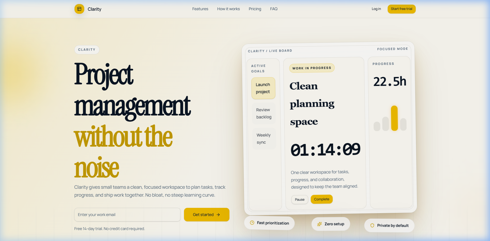
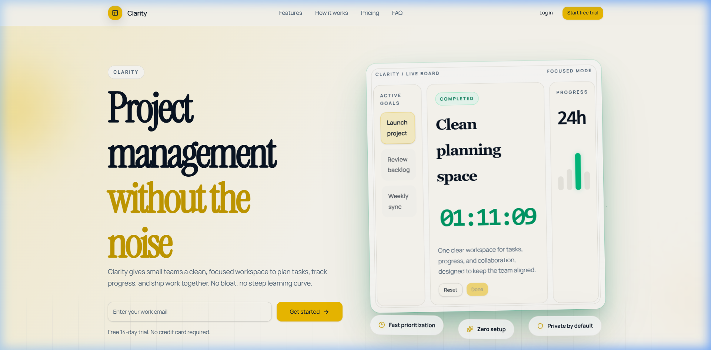
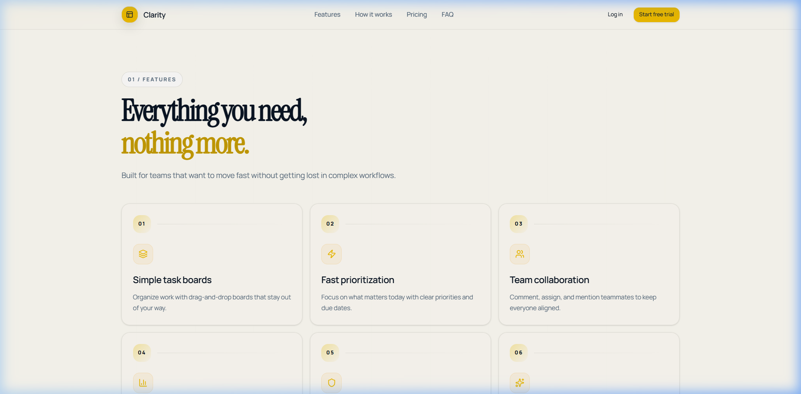
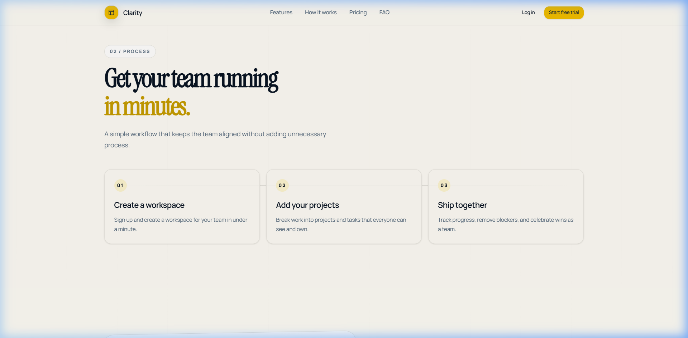
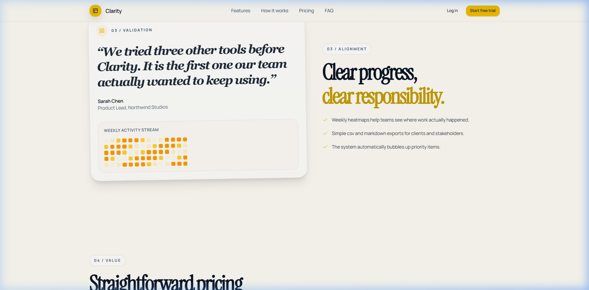
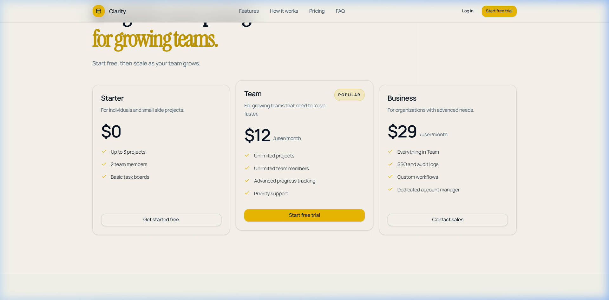
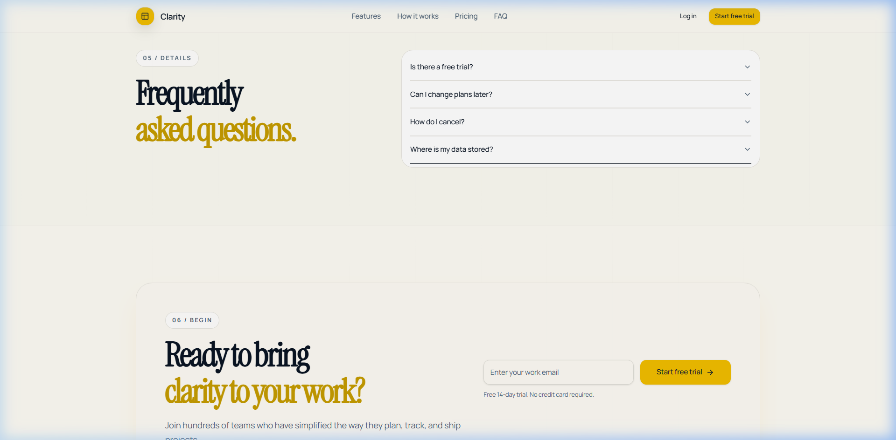

# Clarity Landing Page
A premium, AI-native editorial project management workspace built with TanStack Start, React 19, and Tailwind CSS 4. Locked strictly to a clean, bright light theme with high-contrast amber/emerald telemetry indicators, mathematical timelines, and a blueprint background grid.

---

## 🛠️ Project Stack & Technologies

- **Framework**: [TanStack Start](https://tanstack.com/router/v1/docs/start/overview) (modern React framework with SSR and file-based routing)
- **Vite & React 19**: Ultra-fast hot reloading and production builds using React 19 concurrent features.
- **Styling**: [Tailwind CSS 4.0](https://tailwindcss.com/) & Vanilla CSS custom keyframe animations.
- **Iconography**: [Lucide React](https://lucide.dev/) for high-contrast telemetry symbols.
- **Components**: Radix UI (Shadcn Accordions and Cards).

---

## 📸 Section Walkthroughs & AI prompts

### 1. Hero Section (Active State)

- **Description**: The landing page header features a clean logo and layout, completely free of theme-toggle bloat. The hero layout showcases a 2-column editorial structure, showcasing an email capture form on the left aligned with a floating interactive telemetry panel ("Clarity Live Board") on the right. In the active state, the dashboard exhibits a fast focus vibration (hum) and breathing float motion with a distinct amber glowing shadow.
- **Tools & Tech**: CSS keyframes (`float-active`, `hum-active`), custom `data-status="active"` react attribute, glassmorphic backdrop-blur (`18px`), and a multi-layered gold shadow system.
- **AI Prompt**: 
  > *"Design a premium editorial layout with a floating live board frame on the right side of the hero section. Implement a custom status attribute `data-status` that drives CSS animations based on current status. Create a high-frequency focus hum/vibration that simulates system processing layered over an organic floating motion. Add a rich, multi-layered gold/amber box shadow behind the frame in light mode to make it feel extremely premium."*

---

### 2. Hero Section (Completed State)

- **Description**: When the user clicks the "Complete" button, the dashboard enters the completed state. The timer scale slightly shrinks, the progress value updates, the active progress bar turns emerald green, and the shadow backlight transforms into a beautiful emerald green glow, representing a calm, satisfying finish.
- **Tools & Tech**: Dynamic state hook management, Lucide React icon integration, transition filters, and conditional CSS classes.
- **AI Prompt**: 
  > *"Create a completed state for the hero dashboard frame. When the user completes the goal, transition the floating animation to a calm, slow glide, turn the active progress bars green, display a minty Completed status badge, and transition the gold shadow to a glowing emerald green backlight. Ensure all transitions occur smoothly over 400ms."*

---

### 3. Features Section

- **Description**: Features are presented in a structured grid with card numbers, inline dividers, and custom icons. Hovering over a card slightly tilts it and animates/rotates the icon container with a custom transition.
- **Tools & Tech**: CSS hover scale-transforms, Lucide `Layers`, `Zap`, `Users`, `BarChart3`, `Shield`, and `Sparkles` icons, custom absolute blueprint grid overlay (`global-gridline`).
- **AI Prompt**: 
  > *"Redesign the Features section with a premium card grid using a blueprint gridline background. Add systematic kicker headers like `01 / Features`. Map each feature to a distinct Lucide icon placed in a custom rounded card slot. When a user hovers over a feature card, slightly translate the card up, apply a subtle gold border, and scale-rotate the icon container to make the interface feel alive."*

---

### 4. How It Works (Process Section)

- **Description**: A sequential 3-step workflow tracker. A thin connection line runs behind the circular step markers on desktop, creating a cohesive visual process trace.
- **Tools & Tech**: Pseudo-elements (`::before`), relative positioning context, and responsive media queries that transition the connection trace from horizontal on desktop to vertical on mobile viewports.
- **AI Prompt**: 
  > *"Build a beautiful sequential process section with steps connected by a timeline path. The timeline trace line should pass mathematically through the exact centers of the circular step indexes. Ensure the timeline is horizontal on desktop and switches to vertical on mobile screens, adapting seamlessly to the viewport."*

---

### 5. Quote & Activity Heatmap Section

- **Description**: Displays validation from customers. The quote panel inherits the exact glassmorphic theme and border radius of the hero frame. It embeds a mock "Weekly Activity Stream" Git-like heatmap to visually represent team telemetry and accountability.
- **Tools & Tech**: CSS Flexbox, SVG quote marks, linear glassmorphic gradients, React dynamic rendering (14x5 grid layout with math-driven activity levels).
- **AI Prompt**: 
  > *"Redesign the Customer Quote section. Style the quote container as a premium dashboard card using glassmorphic borders. Embed an interactive team activity heatmap grid (14 columns by 5 rows of tiles) showing different shades of amber/yellow activity levels. Next to the quote card, place an alignment checklist featuring pulsing check icons."*

---

### 6. Pricing Section

- **Description**: A 3-tier pricing plan layout. The "Team" card is highlighted with a premium glowing shadow and stands out slightly higher, matching the gold/amber theme of the hero.
- **Tools & Tech**: Card overlays, linear border colors, flex-layout buttons, and custom highlighted scales.
- **AI Prompt**: 
  > *"Redesign the Pricing section to follow the AetherPane design language. Use simple borders, systematic kickers (`04 / Value`), and outline/default buttons. Highlight the central Team card with a multi-layered gold box shadow and lift it slightly higher than other cards on desktop to establish visual hierarchy."*

---

### 7. FAQ & Bottom CTA Section

- **Description**: Simple FAQ accordions followed by a massive final CTA block. Instead of basic redirect buttons, the CTA features an integrated email capture input matching the form in the hero section, encouraging high conversion rates.
- **Tools & Tech**: Radix Accordion, custom input borders, vertical gridlines, and gold shadow depth.
- **AI Prompt**: 
  > *"Redesign the FAQ and CTA footer. Wrap the FAQ block in a clean, border-radius accordion panel. Create a high-end CTA card at the bottom with a blueprint gridline background and an embedded email input capture form that mirrors the layout of the hero form. Add a shadow-amber glow behind the CTA panel to draw attention."*

---

## 📬 Contact and Submission Details

- **Live URL**: [https://clarity-green-eight.vercel.app/](https://clarity-green-eight.vercel.app/)
- **GitHub**: [https://github.com/safwanahmadsaffi/clarity](https://github.com/safwanahmadsaffi/clarity)
